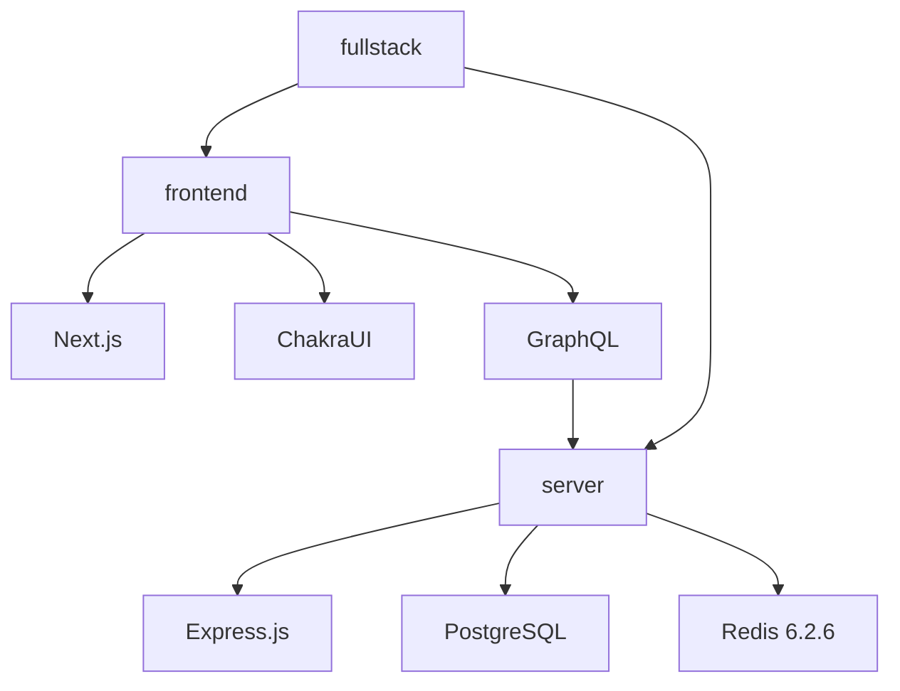

# Full-Stack Reddit Clone Frontend

Hi, welcome to the frontend repository for my full-stack reddit clone built with React/Next.js + Chakra UI on the frontend and Express, PostgreSQL, Redis, and GraphQL for the API and backend management. This repository contains only the frotend code for the project, so be sure to view the backend repo to get the full picture.

#### Disclaimer
I built this project following Ben Awad's [13 Hour Fullstack Tutorial on Youtube](https://www.youtube.com/watch?v=I6ypD7qv3Z8), although with some personal customizations made by myself on both the frontend and backend. Other changes were made as well, mostly due to dependencies changing in the year and a half since the tutorial has been made. This was mostly to get my feet wet with using both frontend and backend in one project and getting Redis up and running, which I haven't had the chance to do up until now. Regardless, Ben is an incredibly talented individual and a great instructor for React+Typescript on Youtube.

# Structure

As stated before, this is the frontend portion of my full-stack website. This repository (named `frontend` locally) is placed in a `fullstack`folder alongside the `server` repo. Next.js listens on port 3000, while the server listens on port 4000. Here's a crude representation of my folder structure and how the two parts mesh:

# Getting Started

If you're wanting to clone this project for your own machine, it's important to get both your folder structure inline and your dependencies correct. 
- Yarn 1.22.17
- NPM 8.7.0
1. Create a folder in your development directory with the project name. Mine was called `fullstack` as seen on the diagram above.
2. Inside your project folder, `mkdir frontend && cd frontend`
3. `git clone` this repository into your newly created `frontend` folder.
4. `yarn install`
5. `yarn dev` starts the development environment, however you'll want to get the backend setup first.

# To-do's
1. Finish the project, I'm only about 25% into the tutorial at the moment (4 hours).
2. Further customize frontend to create a unique interface
3. Expand `users` schema and develop social profile features